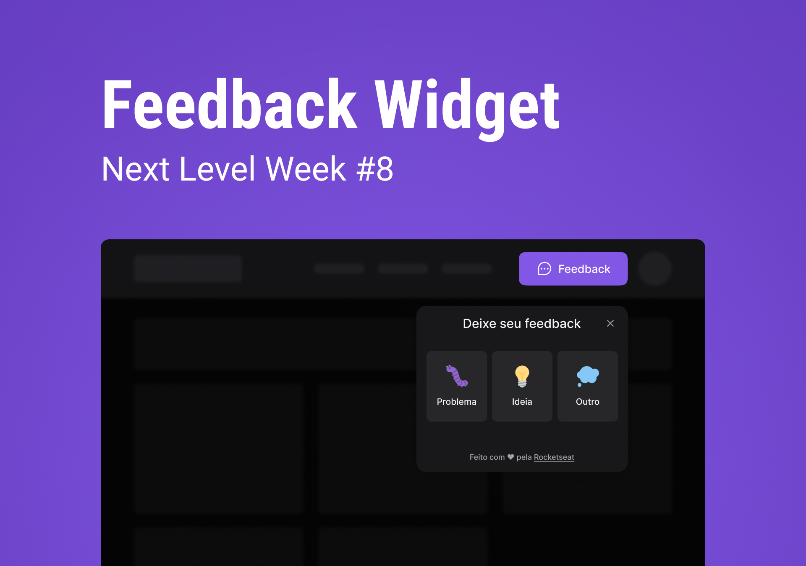

<h1 align="center"> NLW Impulse - Feedback Widget </h1>

Application developed in an event promoted by Rocketseat for teaching WEB and Mobile technologies.

🔗 <a href="https://nlw-impulse-flax.vercel.app/">Clique aqui para acessar a página do projeto</a>

  <a href="#-tecnologias">Tecnologias</a>&nbsp;&nbsp;&nbsp;|&nbsp;&nbsp;&nbsp;
  <a href="#-projeto">Projeto</a>&nbsp;&nbsp;&nbsp;|&nbsp;&nbsp;&nbsp;
  <a href="#-layout">Layout</a>&nbsp;&nbsp;&nbsp;|&nbsp;&nbsp;&nbsp;
  <a href="#memo-licença">Licença</a>

  

 

  

## 🚀 Tecnologias

This project was developed with the following technologies:

- [TypeScript](https://www.typescriptlang.org/)
- [Vite](https://vitejs.dev/guide/)
- [React](https://reactjs.org/)
- [Tailwindcss](https://tailwindcss.com/)
- [Jest](https://jestjs.io/)
- [Prisma](https://www.prisma.io/)
- [PostgreSQL](https://www.postgresql.org/)

## 💻 Projeto

A small and full web widget to receive bug's message, idea's messages and others types of messages with screenshots if its necessary.

## 🔖 Layout

You can view the layout of the project through [THIS LINK](https://www.figma.com/file/BY6xulvpIyLienQAycsyM4/Feedback-Widget-Full?node-id=100-2114&t=HPF4i9ZN6TdRjdfo-0). It is necessary to have an account on [Figma](https://figma.com) to access it.

## :memo: Licença

This project is licensed under the MIT license.

---

Made with ♥ by John :wave: [Participe da comunidade Rocketseat!](https://discord.gg/rocketseat)
